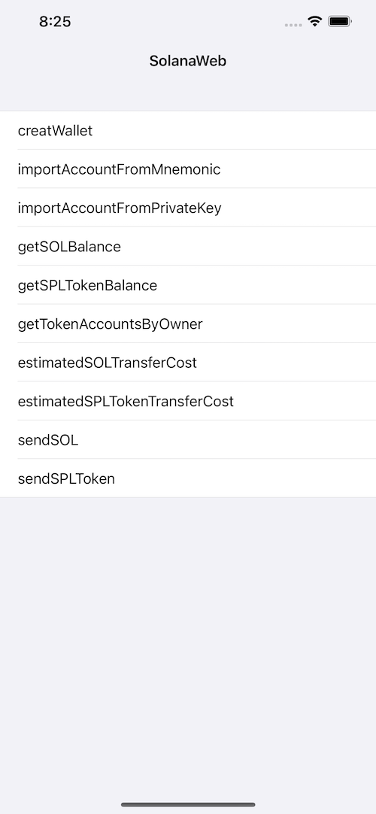

# SolanaWeb
**SolanaWeb** is an iOS toolbelt for interaction with the Solana network.


[](https://www.apple.com/nl/ios/)&nbsp;
[](https://www.swift.org/getting-started/#using-the-package-manager)



For more specific usage, please refer to the [demo](https://github.com/Elizabet1926/Solana/tree/master/Demo)

###  CocoaPods

```ruby
pod 'SolanaWeb', '~> 1.0.3'
```

### Example usage

```swift
import SolanaWeb
```

##### Setup SolanaWeb
```swift
let solanaWeb = SolanaWeb()
if solanaWeb.isGenerateSolanaWebInstanceSuccess {
   transferType == .sendSOL ? sendSOL() : sendSPLToken()
} else {
   solanaWeb.setup(showLog: true) { [weak self] _ in
      guard let self = self else { return }
      self.transferType == .sendSOL ? self.sendSOL() : self.sendSPLToken()
   }
}
```

##### Send SOL
```swift
let privateKey = ""
let toAddress = ""
let amount = ""
solanaWeb.solanaTransfer(privateKey: privateKey, toAddress: toAddress, amount: amount, endpoint: SolanaMainNet) { [weak self] state, txid in
    guard let self = self else { return }
    print("state = \(state)")
    print("txid = \(txid)")
} 
```
##### Send SPLToken
```swift
let privateKey = ""
let toAddress = ""
let tokenAddress = ""
let amount = ""
solanaWeb.solanaTokenTransfer(privateKey: privateKey, toAddress: toAddress, mintAuthority: tokenAddress, amount: amount, endpoint: SolanaMainNet) { [weak self] state, txid in
    guard let self = self else { return }
    print("state = \(state)")
    print("txid = \(txid)")
}
```

For more specific usage, please refer to the [demo](https://github.com/Elizabet1926/Solana/tree/master/Demo)

## License

TronWeb is released under the MIT license. [See LICENSE](https://github.com/Elizabet1926/Solana/blob/master/LICENSE) for details.
